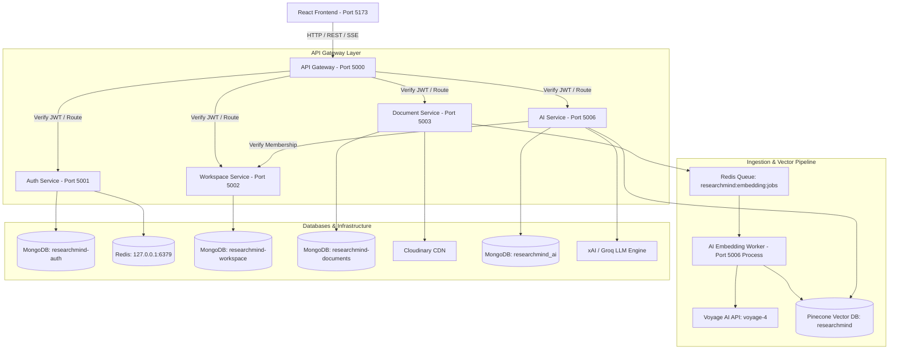

# System Architecture — ResearchMind

## Overview

ResearchMind is an AI-powered research workspace for engineering student teams. The system uses a microservices architecture with isolated data stores, an API Gateway, JWT authentication, specialized domain microservices, and an AI Service powered by Voyage AI, Pinecone, xAI / Groq LLM, Server-Sent Events (SSE), and MongoDB.

---

## High-Level Architecture Diagram

---

## Active Microservices & Ports

| Service Name | Port | Database / Storage | Responsibilities |
|--------------|------|--------------------|------------------|
| **Frontend Client** | `5173` | Local Storage / Zustand | React SPA with Vite, Tailwind CSS, Lucide Icons, and `react-pdf` in-app viewer |
| **API Gateway** | `5000` | Redis (Rate Limiting) | Request routing, JWT access token verification, sliding-window rate limiting, Swagger UI (`/api-docs`) |
| **Auth Service** | `5001` | MongoDB (`researchmind-auth`), Redis | User registration, login, bcrypt password hashing, JWT access/refresh token signing & refresh |
| **Workspace Service** | `5002` | MongoDB (`researchmind-workspace`) | Workspace creation, invite code generation, user membership tracking, membership verification API |
| **Document Service** | `5003` | MongoDB (`researchmind-documents`), Cloudinary, Redis Queue | Multer document upload (PDF/DOCX), text extraction (`pdf-parse`/`mammoth`), Cloudinary storage, `uploadedBy` security, Redis embedding queue producer |
| **AI Service** | `5006` | MongoDB (`researchmind_ai`), Pinecone, Redis Queue | Redis embedding worker consumer, paragraph chunking, Voyage AI embeddings (`voyage-4`), Pinecone vector upsert/search (`namespace: workspaceId`), RAG context builder, Groq/xAI LLM streaming via Server-Sent Events (SSE `POST /api/ai/query`), and MongoDB `AISession` logging |

---

## Core Flows

### 1. Authentication & Workspace Onboarding Flow
1. User registers/logs in via Frontend $\rightarrow$ `POST /api/auth/register` or `POST /api/auth/login` (Gateway `:5000` $\rightarrow$ Auth Service `:5001`).
2. Auth Service returns user profile and signed JWT access token.
3. User creates or joins a workspace via `POST /api/workspaces` or `POST /api/workspaces/join` (Gateway `:5000` $\rightarrow$ Workspace Service `:5002`).
4. Active workspace is stored in Zustand state and persisted across navigation.

### 2. Document Ingestion & Viewing Flow
1. User uploads PDF or DOCX file via `POST /api/documents/upload` with `multipart/form-data`.
2. API Gateway validates JWT access token and forwards request to Document Service (`:5003`).
3. Document Service verifies workspace membership via Workspace Service (`:5002`).
4. `uploadedBy` is set strictly to the authenticated `userId` from the JWT token.
5. Text is extracted from PDF (`pdf-parse`) or DOCX (`mammoth`).
6. Original file is uploaded to Cloudinary (`image` asset type for PDFs; `raw` for DOCX).
7. Document metadata is persisted in MongoDB collection `documents` in `researchmind-documents`.
8. Embedding job payload is pushed to Redis list `researchmind:embedding:jobs`.
9. In-app PDF Viewer (`react-pdf`) renders the document directly inside ResearchMind upon clicking any PDF card.

### 3. Asynchronous Embedding & Vector Indexing Flow
1. AI Worker process in AI Service (`:5006`) pops job from Redis queue `researchmind:embedding:jobs`.
2. Extracted text is split into paragraphs with overlapping chunking.
3. 1024-dimension vector embeddings are generated using Voyage AI API (`voyage-4`).
4. Vectors and metadata (`documentId`, `workspaceId`, `chunkIndex`, `text`, `fileType`) are upserted to Pinecone index `researchmind` isolated by `namespace = workspaceId`.
5. Document status is updated to `indexed` in Document Service.

### 4. RAG Query & Token Streaming Flow (`POST /api/ai/query`)
1. User submits search query via Frontend or HTTP client to `POST /api/ai/query`.
2. API Gateway verifies JWT token and forwards to AI Service (`:5006`).
3. AI Service validates workspace membership via Workspace Service (`:5002`).
4. Search query is vectorized into a 1024-dim embedding via Voyage AI (`embedQuery`).
5. Pinecone searches top-K vector chunks in namespace `workspaceId`.
6. RAG Context Builder constructs structured context with `[Source N]` citations.
7. xAI / Groq LLM Engine streams response tokens over HTTP Server-Sent Events (`Content-Type: text/event-stream`).
8. Event sequence: `start` $\rightarrow$ `sources` (citation array) $\rightarrow$ `token` (streamed text deltas) $\rightarrow$ `done` (`sessionId`).
9. Full Q&A interaction, citations, user ID, workspace ID, and model metadata are logged to MongoDB collection `aisessions` in `researchmind_ai`.
