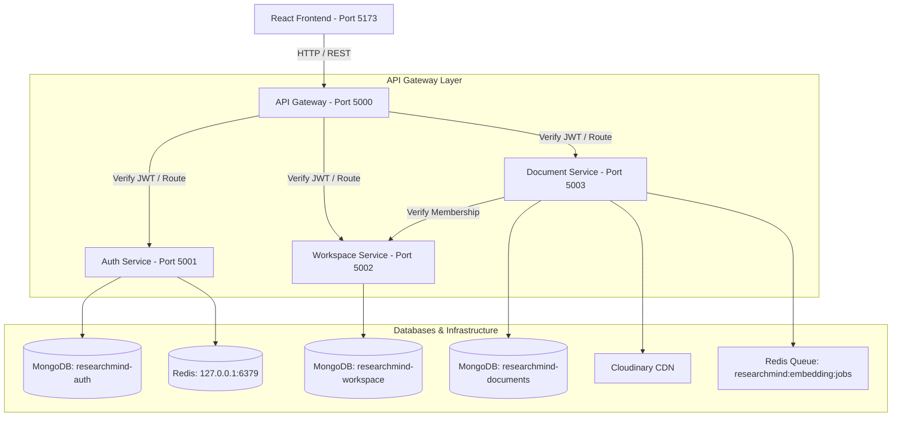

# System Architecture — ResearchMind

## Overview

ResearchMind is an AI-powered research workspace for engineering student teams. The system uses a microservices architecture with isolated data stores, an API Gateway, JWT authentication, and specialized services for auth, workspace management, and document ingestion.

---

## High-Level Architecture Diagram

---

## Active Microservices & Ports

| Service Name | Port | Database / Storage | Responsibilities |
|--------------|------|--------------------|------------------|
| **Frontend Client** | `5173` | Local Storage / Zustand | React SPA with Vite, Tailwind CSS, Lucide Icons, and `react-pdf` in-app viewer |
| **API Gateway** | `5000` | Redis (Rate Limiting) | Request routing, JWT access token verification, sliding-window rate limiting, Swagger UI |
| **Auth Service** | `5001` | MongoDB (`researchmind-auth`), Redis | User registration, login, bcrypt password hashing, JWT access/refresh token signing & refresh |
| **Workspace Service** | `5002` | MongoDB (`researchmind-workspace`) | Workspace creation, invite code generation, user membership tracking, membership verification API |
| **Document Service** | `5003` | MongoDB (`researchmind-documents`), Cloudinary, Redis Queue | Multer document upload (PDF/DOCX), text extraction (`pdf-parse`/`mammoth`), Cloudinary storage, `uploadedBy` security, Redis embedding queue producer |

---

## Core Flows

### 1. Authentication & Workspace Onboarding Flow
1. User registers/logs in via Frontend $\rightarrow$ `POST /api/auth/register` or `POST /api/auth/login` (Gateway `:5000` $\rightarrow$ Auth Service `:5001`).
2. Auth Service returns user profile and signed JWT access token.
3. User creates or joins a workspace via `POST /api/workspaces` or `POST /api/workspaces/join` (Gateway `:5000` $\rightarrow$ Workspace Service `:5002`).
4. Active workspace is stored in Zustand state and persisted across navigation.

### 2. Document Ingestion & Viewing Flow
1. User uploads PDF or DOCX file via `POST /api/documents/upload` with `multipart/form-data`.
2. API Gateway validates JWT access token and forwards request to Document Service (`:5003`).
3. Document Service verifies workspace membership via Workspace Service (`:5002`).
4. `uploadedBy` is set strictly to the authenticated `userId` from the JWT token.
5. Text is extracted from PDF (`pdf-parse`) or DOCX (`mammoth`).
6. Original file is uploaded to Cloudinary (`image` asset type for PDFs; `raw` for DOCX).
7. Document metadata is persisted in MongoDB collection `documents` in `researchmind-documents`.
8. Embedding job payload is pushed to Redis list `researchmind:embedding:jobs`.
9. In-app PDF Viewer (`react-pdf`) renders the document directly inside ResearchMind upon clicking any PDF card.
